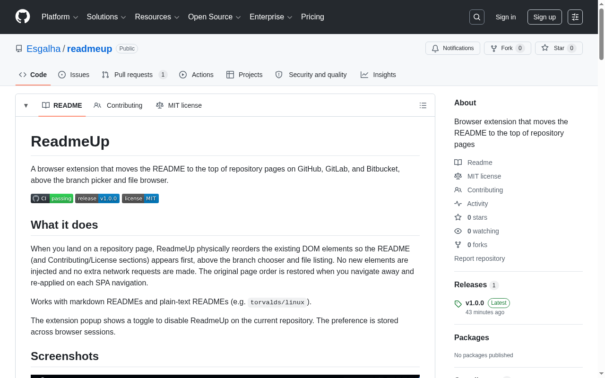
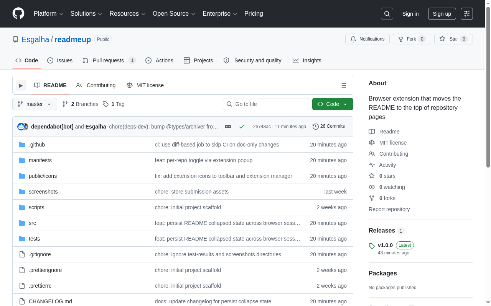
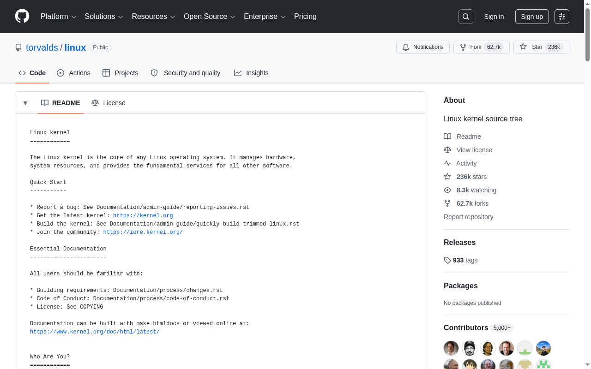
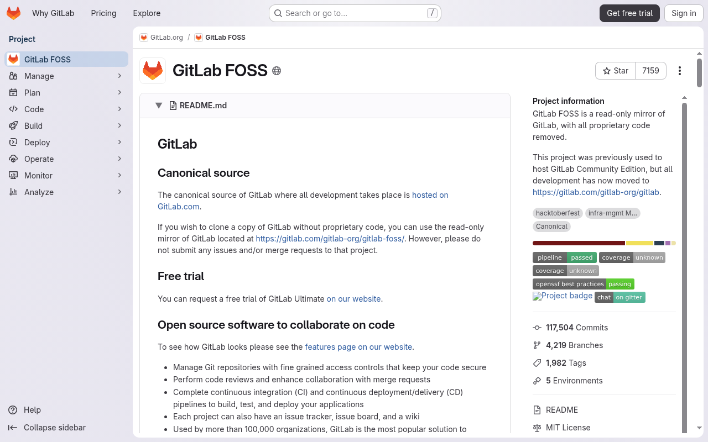
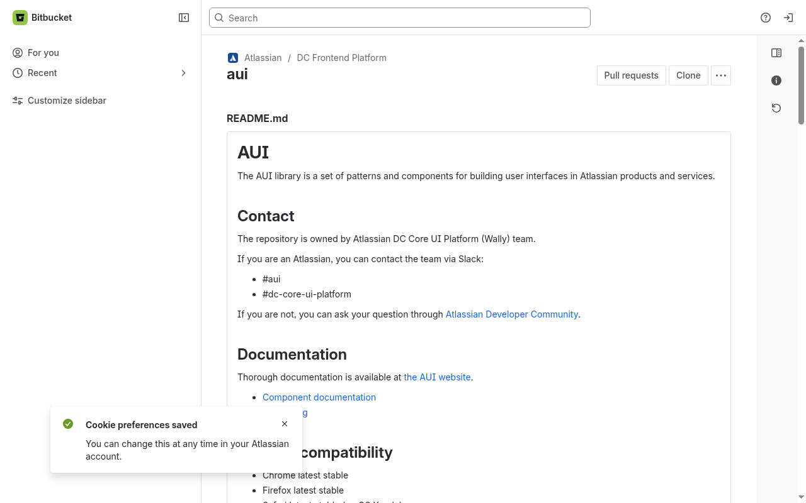

# ReadmeUp

A browser extension that moves the README to the top of repository pages on GitHub, GitLab, and Bitbucket, above the branch picker and file browser.

[](https://github.com/Esgalha/readmeup/actions/workflows/ci.yml)
[](https://github.com/Esgalha/readmeup/releases)
[](LICENSE)

## What it does

When you land on a repository page, ReadmeUp physically reorders the existing DOM elements so the README (and Contributing/License sections) appears first, above the branch chooser and file listing. No new elements are injected and no extra network requests are made. The original page order is restored when you navigate away and re-applied on each SPA navigation.

Works with markdown READMEs and plain-text READMEs (e.g. `torvalds/linux`).

The extension popup shows a toggle to disable ReadmeUp on the current repository. The preference is stored across browser sessions.

## Screenshots

| Expanded                                               | Collapsed                                                        |
| ------------------------------------------------------ | ---------------------------------------------------------------- |
|  |  |

| GitHub — torvalds/linux                                 | GitLab FOSS                            | Bitbucket — Atlassian AUI                                    |
| ------------------------------------------------------- | -------------------------------------- | ------------------------------------------------------------ |
|  |  |  |

## Supported platforms

| Platform  | SPA navigation                               |
| --------- | -------------------------------------------- |
| GitHub    | `turbo:load` + `popstate`                    |
| GitLab    | `MutationObserver` on `<title>` + `popstate` |
| Bitbucket | `popstate`                                   |

## Installation

### Chrome

Install from [Chrome Web Store](https://chromewebstore.google.com/detail/readmeup/blmmekffobioflgmkdfgechgjkicmema).

### Firefox

Install from [Firefox Add-ons](https://addons.mozilla.org/en-US/firefox/addon/readmeup/).

### Load Unpacked (Manual)

1. Clone this repo and run `npm install`
2. Run `npm run build:chrome`
3. Open `chrome://extensions` in Chrome
4. Enable **Developer mode** (top right toggle)
5. Click **Load unpacked** and select the `dist/chrome` folder

For Firefox, run `npm run build:firefox` and load the `dist/firefox` folder as a temporary extension via `about:debugging`.

## Development

### Prerequisites

- Node.js 20 or later
- npm 9 or later

### Install

```bash
npm install
```

### Build

```bash
# Build for Chrome (MV3)
npm run build:chrome

# Build for Firefox (MV2)
npm run build:firefox

# Build both
npm run build

# Package into zip archives
npm run zip
```

### Dev Mode (watch)

```bash
npm run dev:chrome
npm run dev:firefox
```

### Tests

```bash
# Unit and integration tests (Vitest)
npm test

# Watch mode
npm run test:watch

# Coverage report
npm run test:coverage

# End-to-end tests (Playwright - requires npm run build:chrome first)
npm run test:e2e
```

### Lint and Format

```bash
npm run lint
npm run lint:fix
npm run format
npm run format:check
npm run typecheck
```

## Architecture

Single content script entry point (`src/content.ts`). An adapter registry maps the current hostname to a `PlatformAdapter`. On each page load and SPA navigation the content script calls `adapter.reorganize()`, which physically moves DOM elements to put the README first, then `adapter.getCollapseTargets()` to attach a collapse toggle (collapsed state persisted per repo in `browser.storage.local`). If the target elements are not in the DOM yet (SPAs render asynchronously), a `MutationObserver` retry loop watches for up to 5 seconds before giving up.

```
src/
├── adapters/
│   ├── types.ts      # PlatformAdapter interface
│   ├── registry.ts   # hostname → adapter factory map
│   ├── github.ts     # GitHub: walk-up from .markdown-body / <pre>, two-phase hoist
│   ├── gitlab.ts     # GitLab: walk-up from .readme-holder, two-phase hoist
│   └── bitbucket.ts  # Bitbucket: walk-up from <article>
├── collapse.ts       # Platform-agnostic collapse toggle UI
├── storage.ts        # Per-repo enabled/disabled and collapsed state (browser.storage.local)
├── popup/            # Extension popup: version info and per-repo toggle
├── background/       # Minimal MV3 service worker
└── content.ts        # Entry point: adapter selection, run loop, navigation binding
```

### How `reorganize()` works

Each adapter walks up the DOM from the README element, looking for the level where a preceding sibling contains the file-browser table. It then inserts the README section before everything at that level (phase 1). If the file-browser container itself has preceding siblings at its own parent level (e.g. a branch picker bar that lives one level above the file browser), the README is lifted up to that outer level instead, so the final order is always: README, branch bar, file browser (phase 2).

### How `getCollapseTargets()` works

After `reorganize()` succeeds, the content script calls `getCollapseTargets()` to get the two elements needed for the collapse toggle: `anchor` (where the button is inserted) and `collapseTarget` (the element that gets hidden). Each adapter returns the pair that matches its platform's DOM structure, or `null` to skip the toggle entirely (Bitbucket has a native collapse). The toggle itself is platform-agnostic and lives in `collapse.ts`.

## Contributing

See [CONTRIBUTING.md](CONTRIBUTING.md) for guidelines.

## License

MIT

## Privacy

See [PRIVACY.md](PRIVACY.md).
